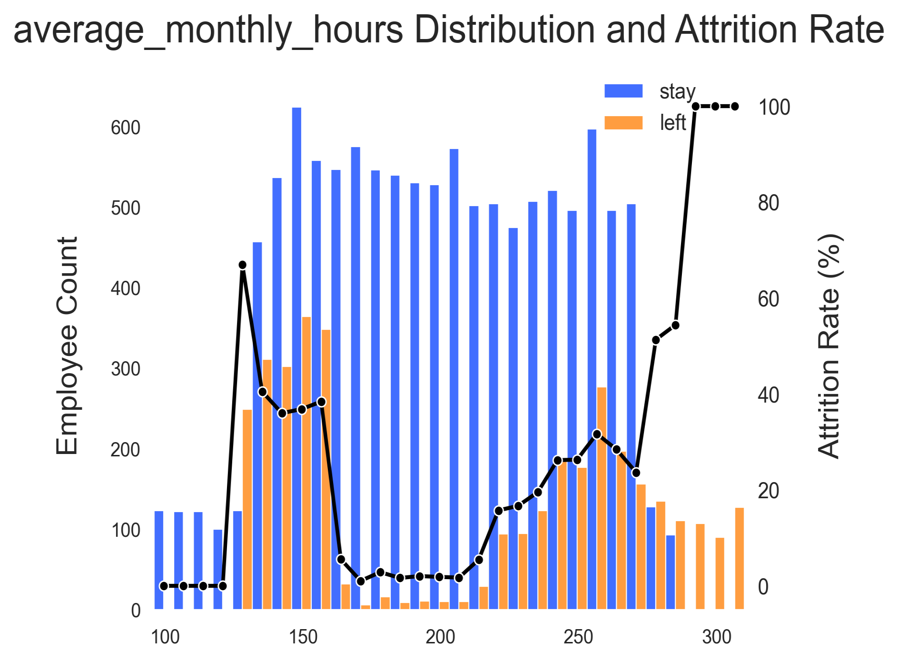
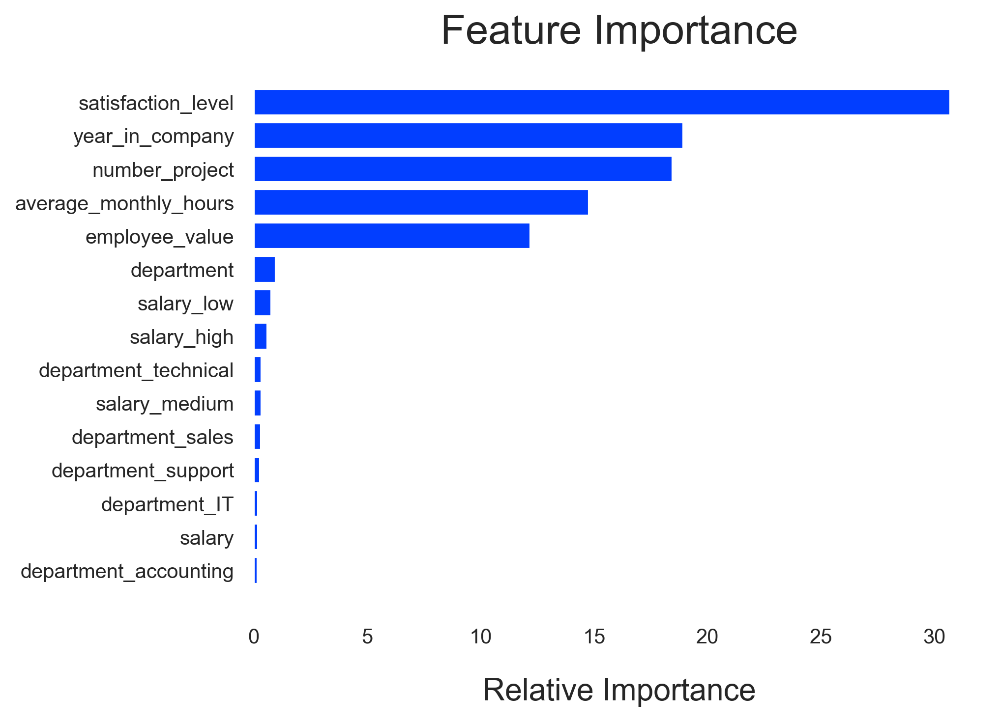
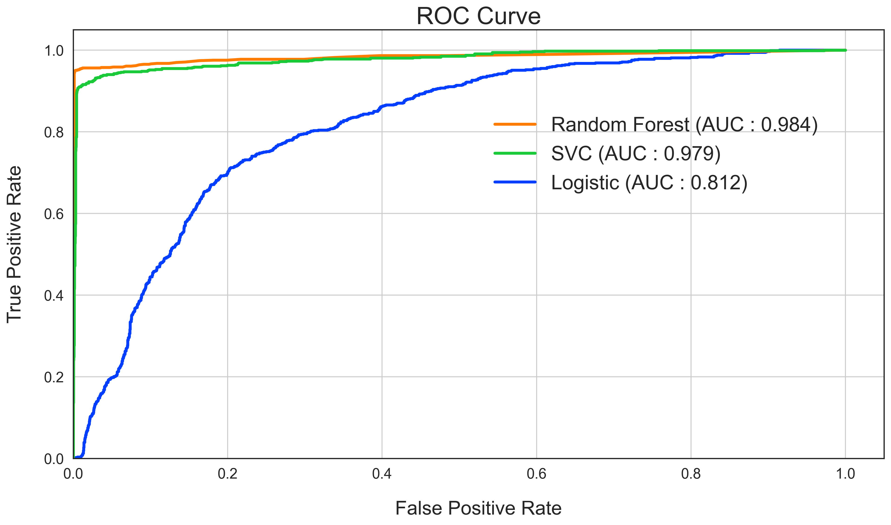

# HR Data for Analytics

## Project Goal
Analyze the HR dataset, find factors that lead to employee attrition, and build a model to predict the attrition using Python.

## What's in the Project
- Perform exploratory data analysis(EDA) and visualize the findings.
- Optimize Logistic Regression, Support Vector, and Random Forest Classifier using GridSearchCV to reach the best model.
- Get the feature importance from the model.

## Code and Resources Used
Python Version: 3.8  
Packages: numpy, pandas, matplotlib, seaborn, sklearn

Dataset: [HR Dataset on Kaggle](https://www.kaggle.com/datasets/jacksonchou/hr-data-for-analytics?datasetId=236694&sortBy=voteCount)

## EDA
Analyze the distributions of variables and how they affect attrition rate. Some questions are:
- How does number of projects affect the attrition rate?
- How do working hours affect the attrition rate?
- How does seniority affect the attrition rate?
- What are the critical factors that lead to employee attrition?

     
     
    

    
     
     

## Model Building
First, split the data into 75% training set and 25% test set. Then, apply standard scaler to numeric variables and encoded categorical variables using one-hot encoding.  Finally, built three models and evaluated them using ROC-AUC score. Three models are:
- Logistic Regression: AUC = 0.812
- Support Vector Classifier: AUC = 0.979
- Random Forest Classifier: AUC = 0.984

    
    

