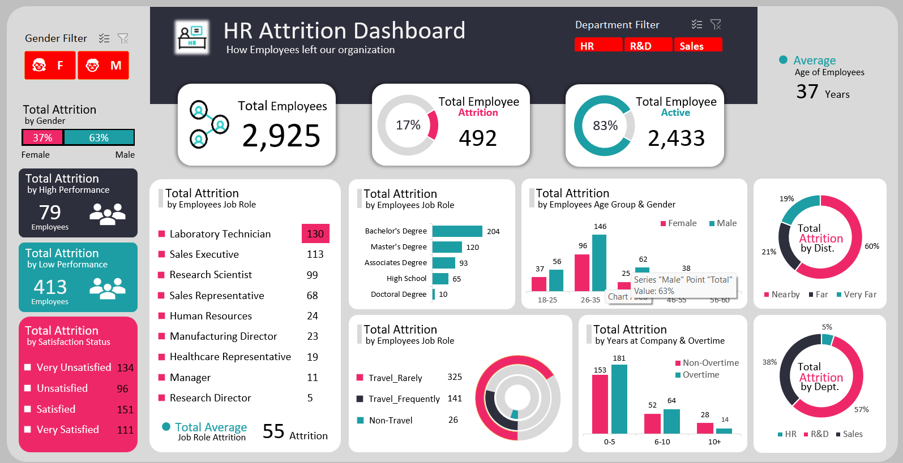

# ***HR Attrition Dashboard***  

## ***Software and Language***
*Excel*  

## ***Project Overview***
Analyzing an HR Attrition dataset with key variables such as gender, age, tenure, department, overtime, performance, and attrition status. The analysis focuses on relationships between attrition and various factors using pivot tables. 

After this analysis, an interactive dashboard is created to present insights visually. Users can explore attrition trends across variables, enhancing the understanding of workforce dynamics.

## ***Results***
 

